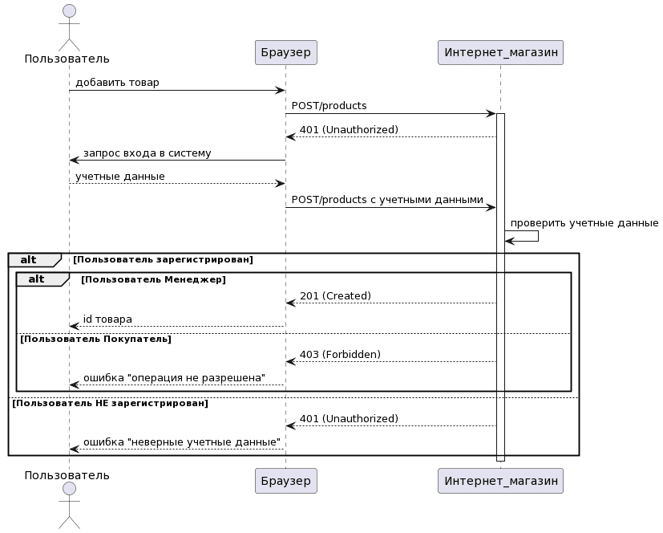

# Проектирование API

<figure><figcaption>
UML диаграмма вызова REST API для use-case "Добавить новый товар"
</figcaption></figure>

Источник:&#x20;

* [https://babok-school.ru/blog/authentication-vs-authorization-in-web-api-and-postman/](https://babok-school.ru/blog/authentication-vs-authorization-in-web-api-and-postman/)
